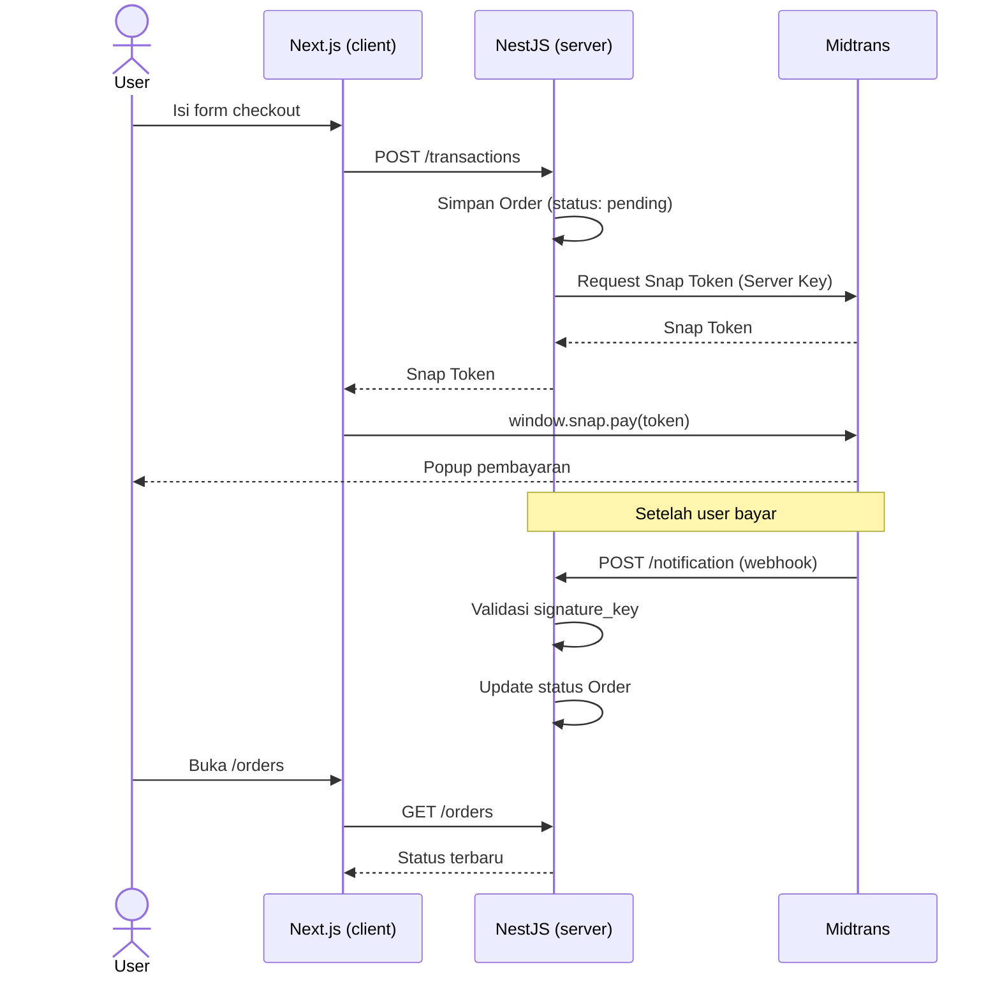

<div align="center">

# 🛍️ Toko Mini

**Belajar integrasi payment gateway Midtrans Snap, dari nol sampai selesai.**

Generate transaction token → trigger popup pembayaran → handle notifikasi webhook → update status pesanan otomatis.

[](https://nextjs.org)
[](https://nestjs.com)
[](https://www.prisma.io)
[](https://www.postgresql.org)
[](https://midtrans.com)

</div>

<br />

> Toko online sederhana (1–3 produk) yang sengaja dibikin minim fitur — nggak ada auth kompleks atau role admin berlapis — biar fokus penuh ke satu hal: **paham alur payment gateway sampai ke akar-akarnya.**

## Daftar Isi

- [Tujuan Belajar](#tujuan-belajar)
- [Tech Stack](#tech-stack)
- [Alur Pembayaran](#alur-pembayaran)
- [Struktur Project](#struktur-project)
- [Fitur](#fitur)
- [Getting Started](#getting-started)
- [Environment Variables](#environment-variables)
- [API Endpoints](#api-endpoints)
- [Testing Webhook Secara Lokal](#testing-webhook-secara-lokal)
- [Desain](#desain)
- [Progress](#progress)

## Tujuan Belajar

- 🔍 Paham alur kerja payment gateway — bukan cuma pasang tombol bayar
- 🔑 Paham bedanya **Client Key** vs **Server Key**
- 🪝 Paham cara handle webhook/notification, termasuk **validasi signature**
- 🚀 Paham cara switch dari sandbox ke production
- 🏗️ Sekalian belajar arsitektur Next.js App Router & NestJS module/controller/service

## Tech Stack

| Bagian | Teknologi |
|---|---|
| **Frontend** | Next.js (App Router), Tailwind CSS |
| **Backend** | NestJS, Prisma ORM, PostgreSQL |
| **Payment** | Midtrans Snap (Sandbox → Production) |

## Alur Pembayaran



## Struktur Project

```
toko-mini/
├── client/                    # Next.js frontend
│   ├── app/
│   │   ├── page.tsx              # list produk
│   │   ├── product/[id]/         # detail produk
│   │   ├── checkout/[id]/        # form checkout + trigger Snap
│   │   ├── orders/               # riwayat pesanan
│   │   └── components/
│   └── lib/                      # helper fetch API & format
└── server/                    # NestJS backend
    ├── prisma/
    │   ├── schema.prisma
    │   └── seed.ts
    └── src/
        ├── products/              # GET /products, GET /products/:id
        ├── transactions/          # POST /transactions (generate Snap token)
        ├── notifications/         # POST /notification (webhook Midtrans)
        ├── orders/                # GET /orders
        └── prisma/                # PrismaService
```

## Fitur

- ✅ List & detail produk
- ✅ Form checkout (nama, email, no HP)
- ✅ Generate Snap Token dari backend, popup pembayaran Midtrans Snap di frontend
- ✅ Webhook notification handler dengan **validasi signature** buat update status order
- ✅ Riwayat pesanan dengan status pembayaran (`pending` / `success` / `failed` / `expired`)

## Getting Started

### Prasyarat

- Node.js 20+
- PostgreSQL berjalan lokal (atau connection string database lain)
- Akun [Midtrans Sandbox](https://dashboard.midtrans.com) — ambil Server Key & Client Key di **Settings → Access Keys**

### 1. Setup Backend

```bash
cd server
npm install
cp .env.example .env   # isi DATABASE_URL, PORT, dan MIDTRANS_* keys
npx prisma migrate dev
npx prisma db seed
npm run start:dev       # jalan di http://localhost:2000
```

### 2. Setup Frontend

```bash
cd client
npm install
cp .env.example .env.local   # isi NEXT_PUBLIC_API_URL & NEXT_PUBLIC_MIDTRANS_CLIENT_KEY
npm run dev                  # jalan di http://localhost:3000
```

## Environment Variables

<table>
<tr><td>

**`server/.env`**

| Variable | Keterangan |
|---|---|
| `DATABASE_URL` | Connection string PostgreSQL |
| `PORT` | Port backend (default `2000`) |
| `MIDTRANS_SERVER_KEY` | 🔒 Rahasia — jangan expose ke frontend |
| `MIDTRANS_CLIENT_KEY` | Client Key dari dashboard Midtrans |
| `MIDTRANS_IS_PRODUCTION` | `false` buat sandbox |

</td><td>

**`client/.env.local`**

| Variable | Keterangan |
|---|---|
| `NEXT_PUBLIC_API_URL` | URL backend, mis. `http://localhost:2000` |
| `NEXT_PUBLIC_MIDTRANS_CLIENT_KEY` | Aman dipakai di frontend |
| `NEXT_PUBLIC_MIDTRANS_IS_PRODUCTION` | `false` buat sandbox |
| | |

</td></tr>
</table>

## API Endpoints

| Method | Endpoint | Keterangan |
|---|---|---|
| `GET` | `/products` | List semua produk |
| `GET` | `/products/:id` | Detail produk |
| `POST` | `/transactions` | Simpan order (`pending`) + generate Snap Token |
| `POST` | `/notification` | Webhook Midtrans, update status order |
| `GET` | `/orders` | Riwayat pesanan |

## Testing Webhook Secara Lokal

Server Midtrans nggak bisa akses `localhost` langsung. Buat testing webhook asli dari sandbox, expose backend pakai [ngrok](https://ngrok.com):

```bash
ngrok http 2000
```

Terus daftarin URL `https://xxxx.ngrok.io/notification` sebagai **Payment Notification URL** di dashboard Midtrans (**Settings → Configuration**).

## Desain

Tema visual **Clean Clinic** — minimalis & monokrom, warna cuma dipakai buat indikator status pembayaran.

<div align="center">

    

</div>


# midtrans-toko-mini
